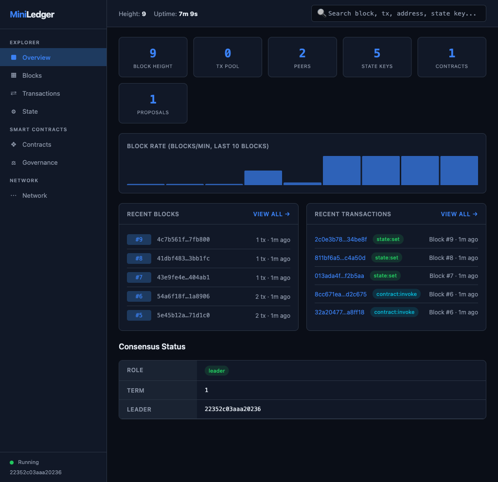

---

```
npm install miniledger
```

MiniLedger is a **private blockchain framework** and **permissioned distributed ledger** that runs in a single Node.js process. Unlike Hyperledger Fabric or R3 Corda, there's no Docker, no Kubernetes, no certificate authorities, and no JVM — just `npm install` and you have a production-ready **consortium blockchain** with Raft consensus, JavaScript smart contracts, per-record encryption, on-chain governance, and full SQL queryability.

Built for **enterprise use cases** like supply chain tracking, audit trails, multi-party data sharing, tokenized assets, and any scenario where you need an **immutable, tamper-proof ledger** without the overhead of public blockchains or the complexity of legacy DLT platforms.

## Why MiniLedger?

- **10-second setup** — `npm install miniledger && npx miniledger start`. No infrastructure.
- **SQL-queryable state** — World state lives in SQLite. Run `SELECT * FROM world_state` directly.
- **Embeddable** — Import as a library into any Node.js/TypeScript app. No separate processes.
- **Enterprise-grade consensus** — Raft leader election with log replication and fault tolerance.
- **Smart contracts in JavaScript** — No Solidity, no Go, no Kotlin. Just plain JS.
- **Built-in block explorer** — Full dashboard with search, drill-down, and SQL console.
- **Lightweight alternative** to Hyperledger Fabric, R3 Corda, and Quorum for teams that want a private blockchain without the operational burden.

## Quick Start

```bash
# Initialize and start a node
npx miniledger init
npx miniledger start

# Submit a transaction
curl -X POST http://localhost:4441/tx \
  -H "Content-Type: application/json" \
  -d '{"key": "account:alice", "value": {"balance": 1000}}'

# Query state with SQL (!)
curl -X POST http://localhost:4441/state/query \
  -H "Content-Type: application/json" \
  -d '{"sql": "SELECT * FROM world_state"}'

# Open the block explorer dashboard
open http://localhost:4441/dashboard
```

## 30-Second Demo

```bash
npx miniledger demo
```

Spins up a **3-node Raft cluster**, deploys a token smart contract, submits sample transactions, and opens the web dashboard — a full blockchain explorer with block/tx drill-down, state browser, contract viewer, governance page, and search.

### Block Explorer Dashboard

<p align="center">
  
</p>

The built-in explorer at `http://localhost:4441/dashboard` includes:
- **Overview** — live stats, block rate chart, recent blocks & transactions
- **Block explorer** — paginated list, drill into any block to see its transactions
- **Transaction viewer** — filter by type, click through to full payload details
- **State browser** — browse all key-value entries or run raw SQL queries
- **Contract inspector** — view deployed smart contracts and their source code
- **Governance** — proposals, vote breakdowns, status tracking
- **Network** — peer list, consensus role, leader info
- **Search** — find blocks by height, transactions by hash, state keys, or addresses

## Transaction Examples

Submit data via `curl` or the CLI:

```bash
# Store a user record
curl -X POST http://localhost:4441/tx \
  -H "Content-Type: application/json" \
  -d '{"key": "user:alice", "value": {"name": "Alice", "balance": 500, "role": "admin"}}'

# Store a product (supply chain, inventory, etc.)
curl -X POST http://localhost:4441/tx \
  -H "Content-Type: application/json" \
  -d '{"key": "product:widget-a", "value": {"name": "Widget A", "price": 29.99, "stock": 142}}'

# Invoke a smart contract method
curl -X POST http://localhost:4441/tx \
  -H "Content-Type: application/json" \
  -d '{"type": "contract:invoke", "payload": {"kind": "contract:invoke", "contract": "token", "method": "mint", "args": [5000]}}'

# Delete a key
curl -X POST http://localhost:4441/tx \
  -H "Content-Type: application/json" \
  -d '{"key": "product:widget-a", "value": null}'

# Query state with SQL
curl -X POST http://localhost:4441/state/query \
  -H "Content-Type: application/json" \
  -d '{"sql": "SELECT key, value FROM world_state WHERE key LIKE '\''user:%'\''"}'
```

Or use the CLI:

```bash
miniledger tx submit '{"key":"sensor:temp-1","value":{"celsius":22.5,"location":"warehouse"}}'
miniledger query "SELECT * FROM world_state ORDER BY updated_at DESC LIMIT 10"
```

## Programmatic API (Embeddable Blockchain)

Use MiniLedger as a library — embed a private blockchain directly in your Node.js application:

```typescript
import { MiniLedger } from 'miniledger';

const node = await MiniLedger.create({ dataDir: './my-ledger' });
await node.init();
await node.start();

// Submit a transaction
await node.submit({ key: 'account:alice', value: { balance: 1000 } });

// Query state with SQL
const results = await node.query(
  'SELECT * FROM world_state WHERE key LIKE ?',
  ['account:%']
);

// Deploy a smart contract
await node.submit({
  type: 'contract:deploy',
  payload: {
    kind: 'contract:deploy',
    name: 'token',
    version: '1.0',
    code: `return {
      mint(ctx, amount) {
        const bal = ctx.get("balance:" + ctx.sender) || 0;
        ctx.set("balance:" + ctx.sender, bal + amount);
      }
    }`
  }
});
```

## Features

| Feature | Description |
|---------|-------------|
| **Zero config** | No Docker, no K8s, no certificate authorities. Single Node.js process. |
| **SQL-queryable state** | World state stored in SQLite. Run SQL queries directly against the ledger. |
| **Raft consensus** | Production-grade leader election, log replication, and fault tolerance. |
| **Smart contracts** | Write and deploy contracts in JavaScript. No Solidity required. |
| **Per-record privacy** | AES-256-GCM field-level encryption with ACLs. No channels needed. |
| **On-chain governance** | Propose and vote on network changes. Quorum-based decision making. |
| **Block explorer** | Built-in web dashboard with search, pagination, and drill-down views. |
| **P2P networking** | WebSocket mesh with auto-reconnect and peer discovery. |
| **Ed25519 identity** | Audited cryptographic signatures. No PKI setup required. |
| **TypeScript native** | Full type safety. Dual CJS/ESM package. Embed in any Node.js app. |

## Use Cases

MiniLedger is ideal for:

- **Supply chain tracking** — Immutable record of goods movement across organizations
- **Audit trails** — Tamper-proof logs for compliance, finance, and healthcare
- **Multi-party data sharing** — Shared ledger between organizations without a central authority
- **Asset tokenization** — Issue and transfer digital tokens with smart contracts
- **IoT data integrity** — Sensor data committed to an immutable ledger
- **Document notarization** — Timestamped, cryptographically signed record keeping
- **Internal microservice ledger** — Embed a tamper-proof log in any Node.js backend
- **Rapid prototyping** — Build and test distributed ledger applications in minutes, not weeks

## Architecture

```
                    ┌───────────┐
                    │    CLI    │
                    └─────┬─────┘
                          │
                    ┌─────▼─────┐
                    │   Node    │  (orchestrator)
                    └─────┬─────┘
                          │
      ┌───────┬───────┬───┴───┬───────┬───────┐
      │       │       │       │       │       │
   ┌──▼──┐ ┌─▼───┐ ┌─▼────┐ ┌▼─────┐ ┌▼────┐ ┌▼───────┐
   │ API │ │Raft │ │ P2P  │ │Contr.│ │Gov. │ │Privacy │
   └──┬──┘ └──┬──┘ └──┬───┘ └──┬───┘ └──┬──┘ └───┬────┘
      └───────┴───────┴────┬───┴────────┴────────┘
                    ┌──────▼──────┐
                    │    Core     │  (blocks, transactions, merkle)
                    └──────┬──────┘
              ┌────────────┼────────────┐
        ┌─────▼─────┐           ┌──────▼─────┐
        │  SQLite    │           │  Ed25519    │
        └────────────┘           └─────────────┘
```

## Multi-Node Consortium Cluster

Set up a multi-organization private network:

```bash
# Node 1 (bootstrap)
miniledger init -d ./node1
miniledger start -d ./node1 --consensus raft --p2p-port 4440 --api-port 4441

# Node 2 (joins the network)
miniledger init -d ./node2
miniledger join ws://localhost:4440 -d ./node2 --p2p-port 4442 --api-port 4443

# Node 3 (joins the network)
miniledger init -d ./node3
miniledger join ws://localhost:4440 -d ./node3 --p2p-port 4444 --api-port 4445
```

Each node maintains a full copy of the ledger. Raft consensus ensures all nodes agree on the same block history, with automatic leader election and fault tolerance.

## CLI Commands

| Command | Description |
|---------|-------------|
| `miniledger init` | Initialize a new node (create keys, genesis block) |
| `miniledger start` | Start the node |
| `miniledger join <addr>` | Join an existing network |
| `miniledger demo` | Run a 3-node demo cluster |
| `miniledger status` | Show node status |
| `miniledger tx submit <json>` | Submit a transaction |
| `miniledger query <sql>` | Query state with SQL |
| `miniledger keys show` | Show node's public key |
| `miniledger peers list` | List connected peers |

## REST API

| Endpoint | Method | Description |
|----------|--------|-------------|
| `/status` | GET | Node status (height, peers, uptime) |
| `/blocks` | GET | Block list (paginated: `?page=N&limit=M`) |
| `/blocks/:height` | GET | Block by height |
| `/blocks/latest` | GET | Latest block |
| `/tx` | POST | Submit transaction |
| `/tx/:hash` | GET | Transaction by hash |
| `/tx/recent` | GET | Confirmed transactions (paginated, filterable by `?type=`) |
| `/tx/sender/:pubkey` | GET | Transactions by sender address |
| `/state` | GET | State entries (paginated: `?page=N&limit=M`) |
| `/state/:key` | GET | State entry by key |
| `/state/query` | POST | SQL query (`{sql: "SELECT ..."}`) |
| `/search` | GET | Unified search (`?q=<block height, tx hash, key, address>`) |
| `/peers` | GET | Connected peers |
| `/consensus` | GET | Consensus state |
| `/proposals` | GET | Governance proposals |
| `/proposals/:id` | GET | Proposal by ID |
| `/contracts` | GET | Deployed contracts |
| `/identity` | GET | Node identity |
| `/dashboard` | GET | Web explorer dashboard |

## Comparison with Enterprise Blockchain Platforms

| | MiniLedger | Hyperledger Fabric | R3 Corda | Quorum |
|---|---|---|---|---|
| **Setup time** | 10 seconds | Hours/days | Hours | Hours |
| **Dependencies** | `npm install` | Docker, K8s, CAs | JVM, Corda node | JVM, Go-Ethereum |
| **Config files** | 0 (auto) | Dozens of YAML | Multiple configs | Genesis + static nodes |
| **Consensus** | Raft (built-in) | Raft (separate orderer) | Notary service | IBFT / Raft |
| **Smart contracts** | JavaScript | Go/Java/Node | Kotlin/Java | Solidity |
| **State queries** | SQL | CouchDB queries | JPA/Vault | No native query |
| **Privacy** | Per-record ACLs | Channels (complex) | Point-to-point | Private transactions |
| **Governance** | On-chain voting | Off-chain manual | Off-chain | Off-chain |
| **Dashboard** | Built-in explorer | None (3rd party) | None | None |
| **Embeddable** | Yes (npm library) | No | No | No |

## Tech Stack

- **Runtime:** Node.js >= 22
- **State:** SQLite (better-sqlite3, WAL mode)
- **Crypto:** @noble/ed25519 + @noble/hashes (audited, pure JS)
- **P2P:** WebSocket mesh (ws)
- **HTTP:** Hono
- **CLI:** Commander
- **Build:** tsup (dual CJS/ESM)
- **Tests:** Vitest (86 tests)

## License

Apache-2.0

---

<p align="center">
  <br />
  <a href="https://chainscorelabs.com">
    <picture>
      <source media="(prefers-color-scheme: dark)" srcset="assets/chainscore-labs-dark.png" />
      <source media="(prefers-color-scheme: light)" srcset="assets/chainscore-labs-light.png" />
      
    </picture>
  </a>
</p>

<p align="center">
  Built by <a href="https://chainscorelabs.com"><strong>Chainscore Labs</strong></a> — blockchain infrastructure and developer tooling.
  <br />
  Need custom blockchain solutions, integrations, or developer tooling?
  <br />
  <a href="mailto:hello@chainscore.finance">hello@chainscore.finance</a> &nbsp;&middot;&nbsp; <a href="https://chainscorelabs.com">chainscorelabs.com</a>
</p>
